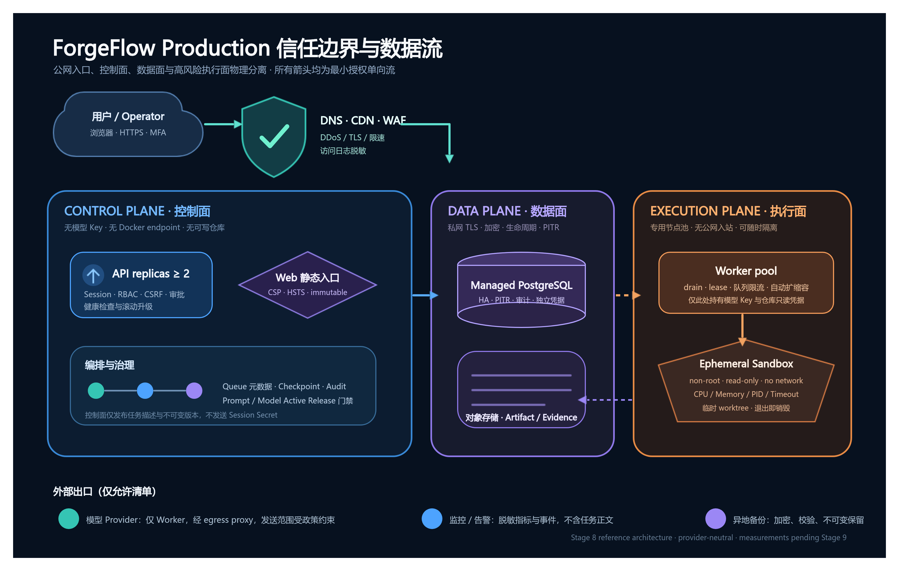

# ForgeFlow Production 参考架构

> 状态：阶段 8 逻辑基线；云厂商、Region、网络地址和账号不进入仓库
> 审批方式：仓库所有者合并阶段 8 PR 即表示接受逻辑边界，不表示授权上线
> Production 流量门禁：阶段 9 的真实证据和最终 Go/No-Go 仍必须通过

## 1. 架构图

可审查源文件：[SVG](../diagrams/2026-09-08T172047/diagram.svg)；可编辑转换产物：[OpenAPI JSON](../diagrams/2026-09-08T172047/diagram.json)。几何检查结果为 0 text overflow、0 node overlap、0 text occlusion。

## 2. 不可复用的 Staging 假设

`deploy/staging` 是单机验收拓扑，只用内部网络模拟信任边界。Production 禁止直接复制以下假设：

- API、Worker、数据库、Sandbox Engine 不得共享一台宿主机或同一个 Docker daemon。
- PostgreSQL 不得依赖单机 Volume；必须具备高可用、TLS、自动备份、PITR 和独立监控。
- Artifact 不得依赖 API/Worker 共享的本地目录；必须迁移到受控对象存储。
- Secret 不得长期保存为普通主机文件；使用 Secret Manager/Vault 通过短期身份或只读 CSI/文件挂载注入。
- Prometheus/Alertmanager 不得与业务主机共享故障域；审计与告警记录必须在业务主机失陷时仍可用。

## 3. 逻辑拓扑

| 区域 | 组件 | 最小权限与可用性要求 | 明确禁止 |
|---|---|---|---|
| 公网边缘 | DNS、CDN、DDoS、WAF、TLS Load Balancer | 仅 443；TLS 1.2+；访问日志脱敏；健康检查与连接排空 | 直接访问 API Pod、数据库或 Worker |
| 控制面 | 静态 Web、至少 2 个 API 实例 | 跨故障域；无模型 Key、仓库凭据或 Docker endpoint；滚动升级 | 可写仓库挂载、通用 Shell、公共数据库入口 |
| 数据面 | Managed PostgreSQL、对象存储、审计/Telemetry 后端 | 私网 TLS、独立身份、静态加密、PITR、生命周期与访问审计 | 公网匿名访问、共享管理员凭据、原地恢复覆盖在线库 |
| 执行面 | 专用 Worker 节点池、隔离 Sandbox Engine、临时 Sandbox | 无公网入站；按队列扩缩；Worker 可 drain；每任务临时 worktree；Sandbox 默认无网络 | 与控制面共享 daemon、挂宿主 Docker Socket、持久化任务容器 |
| 外部出口 | 模型 Provider、告警通道、异地备份 | 固定目的地 allowlist；经 egress proxy/NAT；记录目的与字节量；凭据分离 | API/Sandbox 任意出网、在日志中记录请求正文或 webhook |

云厂商产品选择可以变化，但以上区域不能合并。Region、账号、VPC、KMS Key、Bucket 和联系人只保存在私有基础设施与运维系统。

## 4. 网络与身份矩阵

| 来源 | 目标 | 协议 | 身份 | 数据范围 |
|---|---|---|---|---|
| 浏览器 | WAF/LB | HTTPS 443 | Session + CSRF；管理员额外 MFA | 页面/API 请求；禁止 Secret 与仓库源码进入 URL |
| WAF/LB | Web/API | HTTPS/mTLS | 工作负载身份 | 经过限速和大小限制的请求 |
| API | PostgreSQL | TLS 5432 | 控制面 DB 角色 | 用户、Run、审批、Checkpoint、治理和 Artifact metadata |
| API | 对象存储 | HTTPS 443 | API 只读/短期签名身份 | 经 owner/RBAC 验证后的 Artifact 读取 |
| Worker | PostgreSQL | TLS 5432 | 独立执行面 DB 角色 | Job claim、Checkpoint、Evidence metadata；禁止用户/Session 管理写入 |
| Worker | 对象存储 | HTTPS 443 | Worker 写入身份 | 带 SHA-256、大小、租户/Run 前缀的 Artifact body |
| Worker | Sandbox Engine | mTLS 2376 | 每节点短期客户端证书 | 固定 digest 镜像与受限运行参数 |
| Worker | 模型 Provider | HTTPS 443 | 独立 Provider Key | 已告知且受限的任务、规则和源码片段；不含 Secret/隐藏测试 |
| Telemetry Agent | 受控后端 | mTLS/HTTPS | 遥测写入身份 | 脱敏 Trace、低基数 Metric、结构化日志 |
| Backup service | 异地备份 | HTTPS 443 | 备份专用身份 | 加密数据库备份、Artifact 清单和完整性 metadata |

默认拒绝矩阵之外的连接。生产防火墙、Security Group 或 NetworkPolicy 必须从本表生成并在阶段 9 做连通性/拒绝测试。

## 5. 关键数据流

### 5.1 登录与控制

浏览器经 WAF/LB 到 API；API 验证 Argon2id、Session、CSRF 和 RBAC，仅把 Token Hash 和审计事件写入 PostgreSQL。边缘、API 和审计日志不得记录 Cookie、密码或 CSRF Token。

### 5.2 Run 与审批

API 将 Run/Checkpoint 和事务 Outbox 写入 PostgreSQL。Worker 使用独立角色从 Queue claim Job，不通过公网 API 获取工作。审批只修改绑定版本的状态，Worker 领取前再次验证 ETag 版本、Prompt/model Active Release、Policy、Tool 和 workspace 摘要。

### 5.3 执行与 Artifact

Worker 从受控仓库源建立临时 worktree，通过 mTLS 调度固定 digest Sandbox。Sandbox 无网络、非 root、只读根文件系统，并受 CPU/Memory/PID/超时约束。Patch、测试和报告先计算 SHA-256，再由 Worker 写入对象存储；PostgreSQL 只保存不可猜 storage key、摘要、大小和类型。API 在 owner/RBAC 检查后读取或签发短时下载 URL。

当前代码仅实现 `artifact.Store` 的本地文件后端，且 Production 对象存储适配器尚未接入进程组合。阶段 9 开始 Production 部署前必须实现并测试对象存储后端、双写/迁移或一次性导入方案；在此之前仅允许 Staging fixture，不允许 Production 用户数据。

### 5.4 Telemetry 与备份

应用只输出低基数指标、脱敏结构化日志和采样 Trace。Collector 位于独立运维域。PostgreSQL 使用托管 PITR；逻辑备份和 Artifact 清单加密复制到异地不可变存储。恢复一律创建新数据库/前缀，核验 checksum、Migration 和跨存储一致性后再切换，不覆盖在线数据。

## 6. 高可用与变更策略

- API：至少 2 个实例、跨故障域、Pod disruption/连接排空、readiness 失败即移出流量。
- Worker：每个进程当前串行处理一个 Job；容量通过 Worker 副本扩展。扩缩容必须保留至少 30% 已验证余量，缩容先 drain，依赖租约回收而非强杀。
- PostgreSQL：Multi-AZ/同等级 HA，连接池上限按实例总数核算；Migration 只允许向前兼容，应用回滚不执行 Down Migration。
- 对象存储：版本控制、KMS、禁止公网、生命周期、删除保护和访问日志；metadata/body 的孤儿清理由审计任务完成。
- 发布：先冻结 SHA/Prompt/model/Policy/Tool，再构建 digest 镜像；控制面滚动，执行面 drain；健康和 Active Release 不一致时停止。

## 7. 尚待阶段 9 填写的基础设施记录

| 决策 | 负责人 | 阶段 9 必填证据 |
|---|---|---|
| 云厂商、Production Region、数据驻留 | Product Owner + Data Owner | 批准记录、数据位置、子处理者清单 |
| VPC/账号/集群与故障域 | Platform Owner | IaC review、网络拒绝测试、HA 演练 |
| Managed PostgreSQL 规格 | Data Owner | PITR、TLS、连接容量、恢复证据 |
| 对象存储与 KMS | Data Owner + Security Owner | 适配器测试、Bucket Policy、生命周期、恢复一致性 |
| Secret Manager/Vault | Security Owner | 工作负载身份、轮换和撤销演练 |
| WAF/DDoS/MFA | Security Owner | 规则、管理员 MFA 和攻击面测试 |

本文件批准的是逻辑边界，不代表上述供应商资源已采购、部署或验收。
